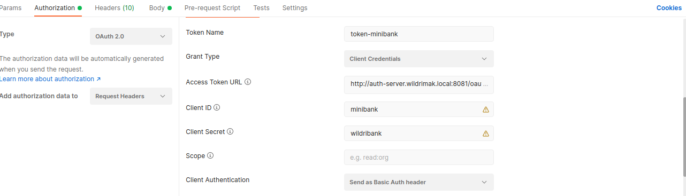

# Mini bank

## Uma aplicação qualquer no qual o client acessa ela com o fluxo de autenticação client credentials

A aplicação tem um endpoint que retorna a representação de contas bancarias, para se conseguir acessar a aplicação 
o servidor de autorização tem os dados do client configurado e esse projeto aponta para esse [servidor de autorização](https://github.com/Wildrimak/authorization-server-spring).

## Como configurar o client postman para se ter acesso a essa aplicação

A url: http://auth-server.wildrimak.local:8081/oauth/access_token é o mesmo que localhost:8081/oauth/access_token

  

